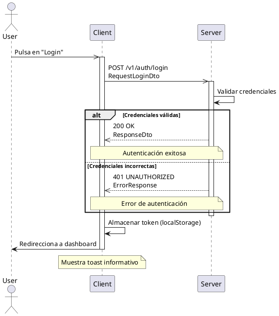

```plantuml
@startuml
actor User
participant Client
participant Server

User ->> Client: Pulsa en "Login"
activate Client

Client ->> Server: POST /v1/auth/login\nRequestLoginDto
activate Server

Server -> Server: Validar credenciales

alt Credenciales válidas
    Server -->> Client: 200 OK\nResponseDto
    note over Client, Server: Autenticación exitosa
else Credenciales incorrectas
    Server -->> Client: 401 UNAUTHORIZED\nErrorResponse
    note over Client, Server: Error de autenticación
end

deactivate Server

Client -> Client: Almacenar token (localStorage)
Client -> User: Redirecciona a dashboard
note over Client: Muestra toast informativo

deactivate Client
@enduml
```
