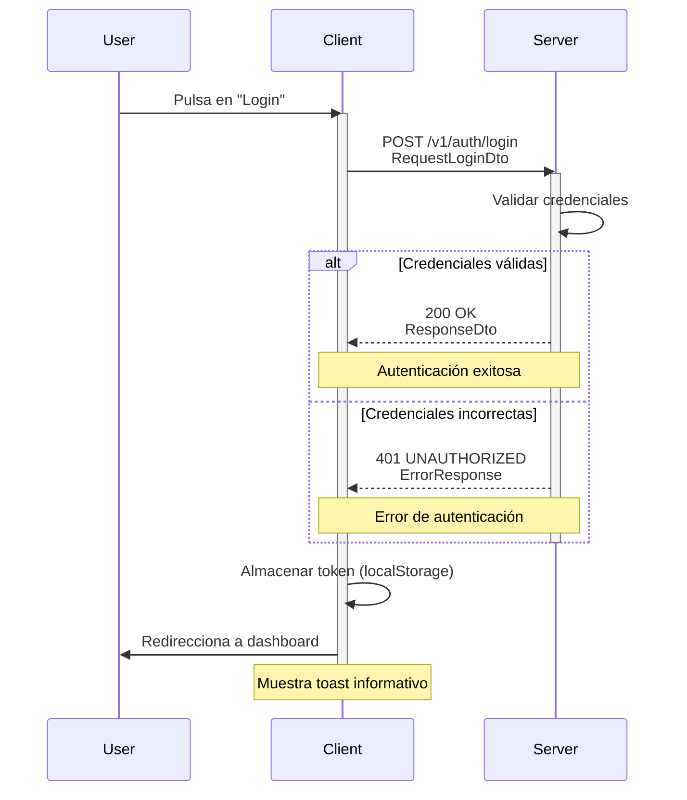
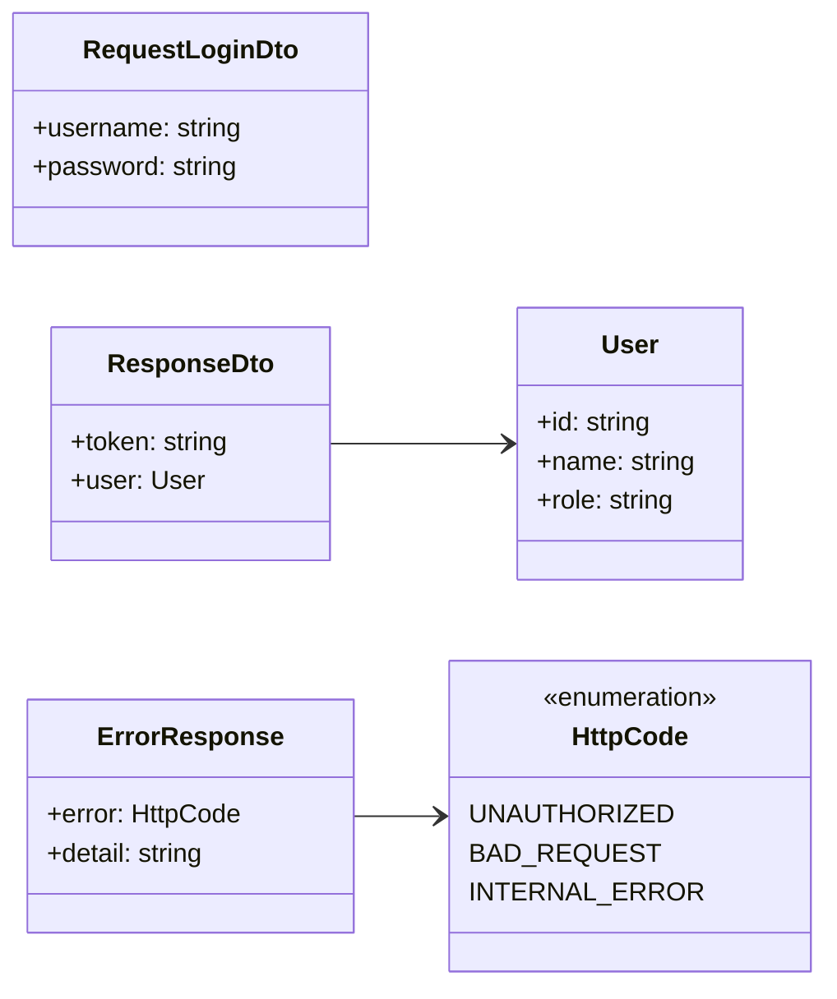

```mermaid
sequenceDiagram
    participant User
    participant Client
    participant Server

    User->>Client: Pulsa en "Login"
    activate Client

    Client->>Server: POST /v1/auth/login<br/>RequestLoginDto
    activate Server

    Server->>Server: Validar credenciales

    alt Credenciales válidas
        Server-->>Client: 200 OK<br/>ResponseDto
        Note over Client,Server: Autenticación exitosa
    else Credenciales incorrectas
        Server-->>Client: 401 UNAUTHORIZED<br/>ErrorResponse
        Note over Client,Server: Error de autenticación
    end

    deactivate Server

    Client->>Client: Almacenar token (localStorage)
    Client->>User: Redirecciona a dashboard
    Note over Client: Muestra toast informativo

    deactivate Client
```

```mermaid
classDiagram
    direction LR

    class RequestLoginDto {
        +username: string
        +password: string
    }

    class ResponseDto {
        +token: string
        +user: User
    }

    class ErrorResponse {
        +error: HttpCode
        +detail: string
    }

    class User {
        +id: string
        +name: string
        +role: string
    }

    class HttpCode {
        <<enumeration>>
        UNAUTHORIZED
        BAD_REQUEST
        INTERNAL_ERROR
    }

    ResponseDto --> User
    ErrorResponse --> HttpCode
```
