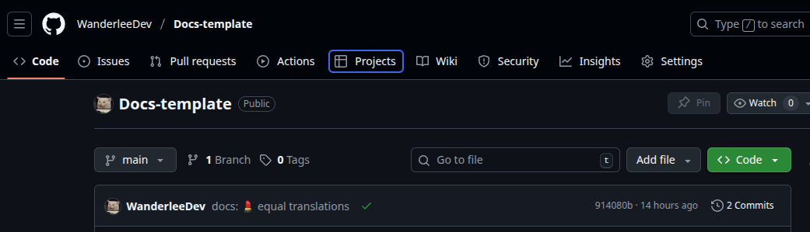

import { Steps } from "@astrojs/starlight/components";
import { Tabs, TabItem } from "@astrojs/starlight/components";

## Prerequisites

Before starting, make sure you have:

- A GitHub account
- An existing repository (or permission to create Projects at the organization level)
- Admin or maintainer access to the repository

## Project Creation

<Tabs>
   <TabItem label="Creation">
      <Steps>
         1. **Navigate to your repository**

            Go to your repository in GitHub and look for the **"Projects"** tab in the top navigation bar.
            

         2. **Create a new Project**

            Click on **"New project"** → **"Create a project"**

         3. **Choose a template**

            GitHub will offer you different options:

            - **Board**: Classic Kanban board (recommended for beginners)
            - **Table**: Table view for structured data
            - **Roadmap**: For temporal planning
            - **Start from scratch**: Blank project

            

         4. **Configure the Project**

            - **Name**: Choose a descriptive name (e.g. "Web Development Q1 2025")
            - **Description**: Add an optional description
            - **Visibility**:
            - **Private**: Only you and collaborators can see it
            - **Public**: Visible to everyone
            - **README**: Optional, but recommended to explain the purpose

      </Steps>

   </TabItem>
   
   <TabItem label="Usage">
      <Steps>
         1. **Move tasks**

            - Drag and drop cards between columns
            - Use keyboard shortcuts for quick navigation
            - Changes are automatically synchronized with the issues

         2. **Filter content**

            - Use the filters to show only:
            - Tasks assigned to you: `assignee:@me`
            - By labels: `label:"bug"`
            - By state: `state:open`

         3. **Invite collaborators**

            - Go to **Settings** → **Manage access**
            - Click on **"Add people"**
            - Enter usernames or emails
            - Assign permissions (Read, Write, Admin)

         4. **Create tasks directly**

            - Click on **"+ Add item"** in any column
            - Write the task title
            - Press Enter to create

         5. **Convert tasks into issues**

            - Click on the created task
            - Select **"Convert to issue"**
            - Choose the destination repository
            - The task will be converted into a linked issue

         6. **Tips and best practices**

            - Use prefixes for task types: `[BUG]`, `[FEATURE]`, `[DOCS]`
            - Be descriptive but concise in the titles
            - Use priority labels consistently

         7. **Practical example**

               Suppose you are developing a web application. Your board might look like this:

               | Backlog               | To Do           | In Progress         | Code Review       | Testing   | Done          |
               | --------------------- | --------------- | ------------------- | ----------------- | --------- | ------------- |
               | UX/UI Design          | Login system    | Payment integration | User registration | Dark mode | Home page     |
               | SEO optimization      | Database schema | -                   | -                 | -         | Setup project |
               | Mobile responsiveness | -               | -                   | -                 | -         | -             |
      </Steps>

   </TabItem>
</Tabs>

## Additional resources

- [Official GitHub Projects documentation](https://docs.github.com/en/issues/planning-and-tracking-with-projects)
