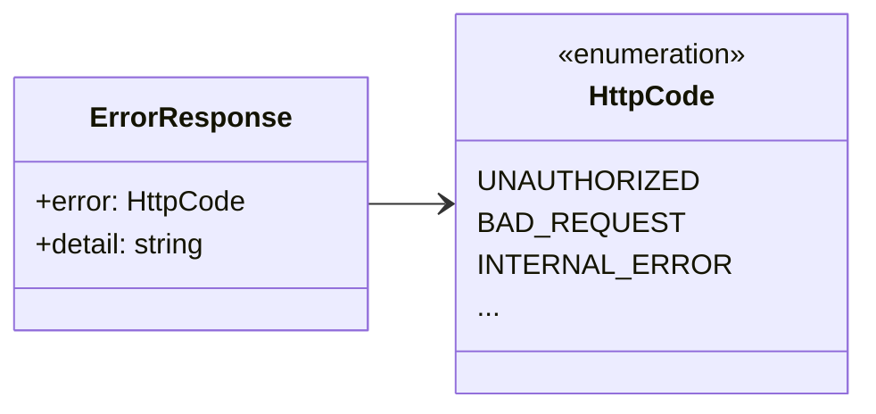

```mermaid
classDiagram
    direction LR

    class ErrorResponse {
        +error: HttpCode
        +detail: string
    }

    class HttpCode {
        <<enumeration>>
        UNAUTHORIZED
        BAD_REQUEST
        INTERNAL_ERROR
        ...
    }

    ErrorResponse --> HttpCode
```
