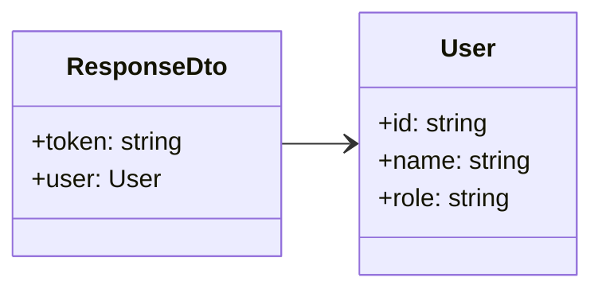

Interface that defines the standard structure of system responses.

## Properties

- `token`: Token of authentication
- `user`:
  - `id`: User identifier
  - `name`: User name
  - `role`: User role
