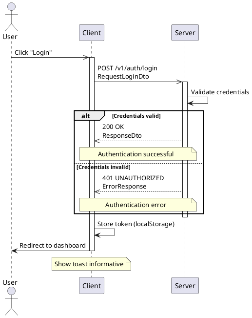
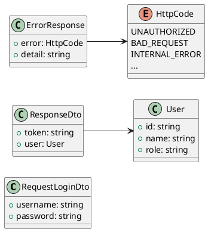

## Class diagram

## HTTP Codes

| Code | Description    | Response                                   |
| ---- | -------------- | ------------------------------------------ |
| 200  | OK             | [ResponseDto](/interfaces/responsedto)     |
| 401  | UNAUTHORIZED   | [ErrorResponse](/interfaces/errorresponse) |
| 400  | BAD_REQUEST    | [ErrorResponse](/interfaces/errorresponse) |
| 500  | INTERNAL_ERROR | [ErrorResponse](/interfaces/errorresponse) |
