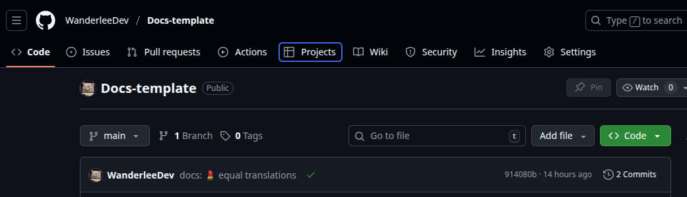
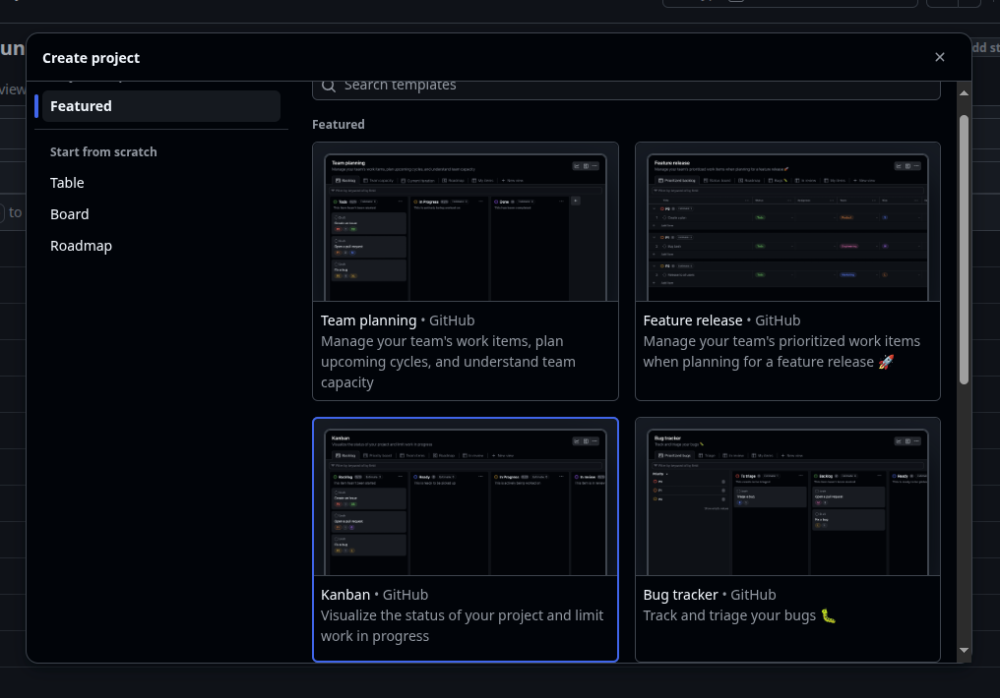

import { Steps } from "@astrojs/starlight/components";
import { Tabs, TabItem } from "@astrojs/starlight/components";

## Prerequisitos

Antes de comenzar, asegúrate de tener:

- Una cuenta de GitHub
- Un repositorio existente (o permiso para crear Proyectos en el nivel de la organización)
- Acceso de administrador o mantenedor al repositorio

## Creación de Proyectos

<Tabs>
   <TabItem label="Creación">
      <Steps>
         1. **Navega a tu repositorio**

            Ve a tu repositorio en GitHub y busca la pestaña **"Proyectos"** en la barra de navegación superior.
            

         2. **Crea un nuevo Proyecto**

            Haz clic en **"Nuevo proyecto"** → **"Crear un proyecto"**

         3. **Elige una plantilla**

            GitHub te ofrecerá diferentes opciones:

            - **Tablero**: Tablero de Kanban clásico (recomendado para principiantes)
            - **Tabla**: Vista de datos para datos estructurados
            - **Roadmap**: Para planificación temporal
            - **Desde cero**: Proyecto en blanco

            

         4. **Configura el Proyecto**

            - **Nombre**: Elige un nombre descriptivo (por ejemplo, "Desarrollo web Q1 2025")
            - **Descripción**: Agrega una descripción opcional
            - **Visibilidad**:
            - **Privado**: Solo tú y colaboradores pueden verlo
            - **Público**: Visible para todos
            - **README**: Recomendado, pero opcional, para explicar el propósito

      </Steps>

   </TabItem>
   
   <TabItem label="Uso">
      <Steps>
         1. **Mover tareas**

            - Arrastra y suelta tarjetas entre columnas
            - Usa atajos de teclado para navegación rápida
            - Los cambios se sincronizan automáticamente con las incidencias

         2. **Filtrar contenido**

            - Usa los filtros para mostrar solo:
            - Tareas asignadas a ti: `assignee:@me`
            - Por etiquetas: `label:"bug"`
            - Por estado: `state:open`

         3. **Invitar colaboradores**

            - Ve a **Configuración** → **Administrar acceso**
            - Haz clic en **"Agregar personas"**
            - Ingresa nombres de usuario o direcciones de correo electrónico
            - Asigna permisos (Lectura, Escritura, Administrador)

         4. **Crear tareas directamente**

            - Haz clic en **"+ Agregar elemento"** en cualquier columna
            - Escribe el título de la tarea
            - Presiona Enter para crear

         5. **Convertir tareas en incidencias**

            - Haz clic en la tarea creada
            - Selecciona **"Convertir en incidencia"**
            - Elige el repositorio de destino
            - La tarea se convertirá en una incidencia enlazada

         6. **Consejos y mejores prácticas**

            - Usa prefijos para los tipos de tarea: `[BUG]`, `[FEATURE]`, `[DOCS]`
            - Sé descriptivo pero conciso en los títulos
            - Usa etiquetas de prioridad de forma consistente

         7. **Ejemplo práctico**

               Supongamos que estás desarrollando una aplicación web. Tu tablero podría verse así:

               | Backlog               | Por hacer           | En progreso            | Revisión de código       | Pruebas  | Hecho          |
               | --------------------- | ------------------ | ---------------------- | ----------------------- | -------- | -------------- |
               | Diseño de UX/UI       | Sistema de inicio de sesión | Integración de pago      | Registro de usuario      | Modo oscuro | Página de inicio |
               | Optimización SEO        | Esquema de base de datos | -                      | -                       | -         | Configurar proyecto |
               | Responsividad móvil   | -                  | -                      | -                       | -         | -             |
      </Steps>

   </TabItem>
</Tabs>

## Recursos adicionales

- [Documentación oficial de Proyectos de GitHub](https://docs.github.com/en/issues/planning-and-tracking-with-projects)
