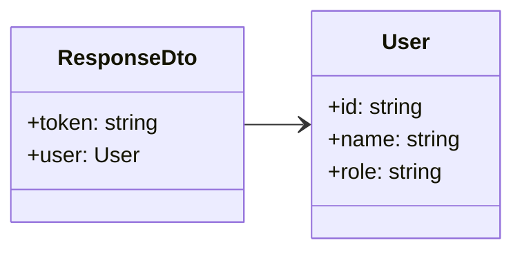

Interfaz que define la estructura estándar de las respuestas del sistema.

## Propiedades

- `token`: Token de autenticación
- `user`:
  - `id`: Identificador del usuario
  - `name`: Nombre del usuario
  - `role`: Rol del usuario
