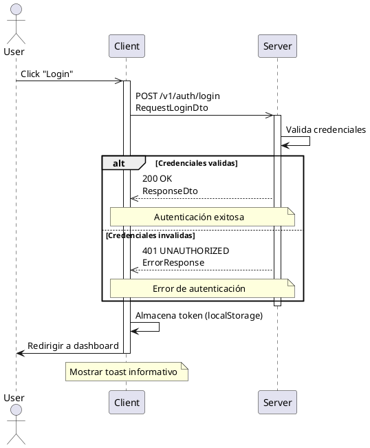
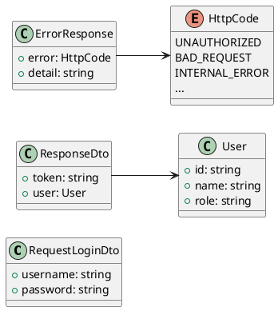

## Diagrama de clases

## Códigos HTTP

| Codigo | Descripción    | Response                                      |
| ------ | -------------- | --------------------------------------------- |
| 200    | OK             | [ResponseDto](/es/interfaces/responsedto)     |
| 401    | UNAUTHORIZED   | [ErrorResponse](/es/interfaces/errorresponse) |
| 400    | BAD_REQUEST    | [ErrorResponse](/es/interfaces/errorresponse) |
| 500    | INTERNAL_ERROR | [ErrorResponse](/es/interfaces/errorresponse) |
